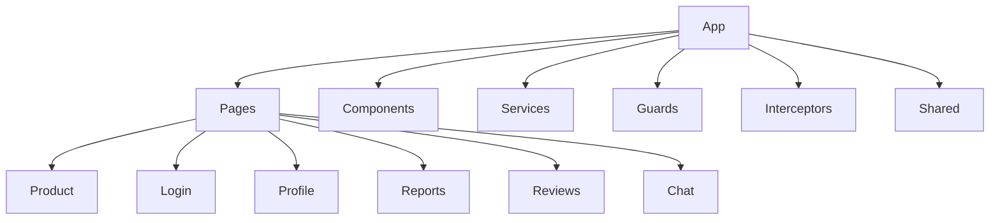

# Buy&Sell Frontend

<p align="center">
  
</p>

<p align="center">

A modern marketplace frontend built with Angular.

Developed as part of the Buy&Sell Full Stack application.

</p>

<p align="center">

[](https://angular.dev/)
[](https://www.typescriptlang.org/)
[](https://getbootstrap.com/)
[](https://rxjs.dev/)

</p>

---

# Overview

Buy&Sell Frontend is a Single Page Application (SPA) developed with Angular.

Its objective is to provide users with an intuitive, responsive and scalable interface for buying and selling second-hand products.

The application communicates with the REST API developed in Express and uses JWT authentication to protect private routes.

---

# Live Demo

buy-sell-front.vercel.app

---

# Related Repositories

## Project Documentation

https://github.com/diegozsr1/buy-sell

## Backend

https://github.com/diegozsr1/buy-sell-back

---

# Main Features

- User Authentication
- Secure Login
- JWT Session Management
- Product Catalogue
- Product Details
- Dynamic Image Gallery
- User Profiles
- Favourite Products
- Product Reports
- User Reviews
- Messaging Interface
- Responsive Navigation
- Admin Area
- Moderator Area

---

# Tech Stack

| Technology | Purpose |
|------------|----------|
| Angular | Frontend Framework |
| TypeScript | Programming Language |
| Signals | Reactive State |
| Bootstrap | UI Components |
| RxJS | Reactive Programming |
| Angular Router | Navigation |
| HttpClient | REST Communication |

---

# Architecture

The frontend follows a modular architecture where each feature is isolated into reusable components and services.



---

# Routing

Angular Router is responsible for navigating between application pages.

The routing system separates:

- Public Routes

- Authenticated Routes

- Administrator Routes

- Moderator Routes

This architecture allows easy scalability while keeping responsibilities separated.

---

# Authentication

Authentication is based on JWT.

Workflow:

User Login

↓

Backend validates credentials

↓

JWT Token generated

↓

Token stored

↓

HTTP Interceptor adds Authorization Header

↓

Backend validates token

↓

Access granted

---

# Guards

The application implements different Guards.

## Authentication Guard

Protects routes that require an authenticated user.

---

## Role Guard

Restricts access depending on user roles.

Example:

- Administrator

- Moderator

- Standard User

---

# HTTP Interceptor

All protected requests automatically include:

Authorization: Bearer TOKEN

This avoids duplicating authentication logic throughout the application.

---

# Components

The interface was designed following reusable component principles.

Some reusable components include:

- Button

- Badge

- Product Card

- Mobile Navigation

- Modal

- Forms

These components are configurable through Inputs and Outputs.

---

# Angular Signals

The project makes use of Angular Signals to simplify reactive state management.

Examples include:

- Selected product image

- Badge state

- Dynamic UI updates

Signals reduce complexity while improving readability and performance.

---

# Responsive Design

The application has been designed using a mobile-first approach.

Responsive elements include:

- Mobile Bottom Navigation

- Responsive Product Cards

- Adaptive Forms

- Flexible Grid Layout

---

# Services

The frontend communicates with the backend through dedicated Angular services.

Examples:

- AuthService

- ProductService

- UserService

- ReportService

- FavouriteService

- ReviewService

Each service encapsulates HTTP communication and business logic.

---

# Folder Structure

```
src/

app/

components/

pages/

guards/

interceptors/

interfaces/

services/

shared/

assets/

environments/
```

---

# Installation

Clone repository

```bash
git clone https://github.com/diegozsr1/buy-sell-front
```

Install dependencies

```bash
npm install
```

Run development server

```bash
ng serve
```

Application available at

```
http://localhost:4200
```

---

# Future Improvements

- Docker support

- Unit Testing

- Internationalization (i18n)

- Dark Theme

- Push Notifications

- Real-time Messaging

- Lazy Loading optimization

---

# Documentation

For complete project documentation visit:

📚 Main Documentation

https://github.com/diegozsr1/buy-sell

---

# Author

Developed collaboratively as part of the UNIR Full Stack Developer Master's Degree.

Frontend contributions by **Diego Zapata** include:

- Routing Architecture

- Mobile Navigation

- Atomic Components

- Product View

- JWT Guards

- HTTP Interceptor

- Reports

- Reviews

- Messaging UI

- Favourite Products

- Responsive Design
